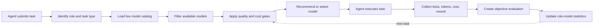
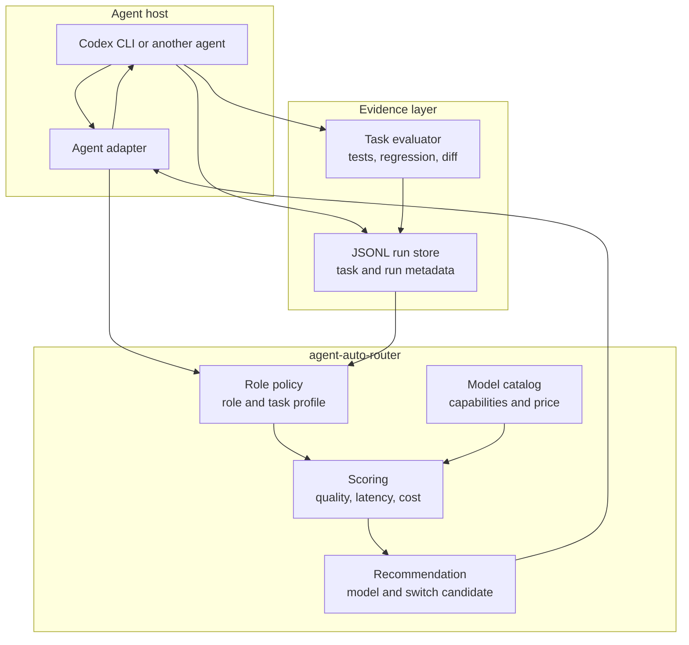

# agent-auto-router

An evidence-driven routing and evaluation tool that helps agents choose the right model for each task.

> In one sentence: the agent submits a task, `agent-auto-router` selects a model; the agent executes the task, and the router records evidence to improve the next decision.

This is not a leaderboard or a request-only proxy. Model choices are traceable, and the default behavior is observe-and-recommend until there is enough evidence to justify a switch. Codex CLI is the first validated host; other agents can connect through adapters.

## End-to-end loop



Selection considers role, task type, tool requirements, model availability, historical quality, success rate, latency, rework, and cost. The default policy is `shadow`: the router explains candidates and switch reasons first; gray rollout or automatic promotion requires the configured admission gates.

## Repository map

| Directory | Purpose |
| --- | --- |
| `src/core/` | Role policy, quality scoring, token/cost calculation, and shared contracts |
| `adapters/` | Codex, command-line agents, provider catalogs, and JSONL adapters |
| `scripts/` | Task execution, session ingestion, price sync, evaluation, and reports |
| `configs/` | Role-model policy and switching thresholds |
| `schema/` | Run, experiment, and report formats |
| `tests/` | Core policy, adapter, and ingestion tests |

## Preview integrations

The current release focuses on role-based model evaluation and switching decisions. The host agent remains responsible for invoking the selected model and completing the task.

| Type | Integration | Status | Notes |
| --- | --- | --- | --- |
| Agent host | Codex CLI | ✅ Validated | Supports role runs, exit status, latency, tokens, cost, and passive local session ingestion |
| Agent host | Generic command-line agent | 🧪 Preview | Uses `adapters/codex/command-runner.mjs`; only Codex has been validated against a real session so far |
| Agent host | Hermes | 📦 Benchmark reference | Existing Hermes benchmark data can be used as experiment input, but the public core does not couple to the Hermes runtime |
| Model provider | AIHubMix | ✅ Validated | Reads `https://aihubmix.com/v1/models`; all current AIHubMix role defaults are present |
| Model provider | Sub2API | ✅ Validated | Reads authenticated `https://ccsub.inferera.com/v1/models`; uses a separate role pool and statistics |
| Model provider | OpenRouter | ✅ Validated | Reads `https://openrouter.ai/api/v1/models`; Responses API was verified with DeepSeek, Kimi, and GLM models |
| Direct providers | OpenAI, Anthropic, DeepSeek, and others | 🔌 Extension point | Direct connections still require their own catalog and execution adapters |
| Persistence | JSONL | ✅ Validated | Stores structured task, role, model, quality, cost, and evidence metadata |
| Evaluation | CLI tests, regression checks, and diff checks | ✅ Validated | Stores objective results without test command stdout/stderr |

### Role vocabulary

`planner`, `researcher`, `explorer`, `implementer`, `e2e`, and `reviewer` are policy roles, not providers or fixed agents. A host can map these roles to different models without copying Codex-specific configuration.

### Provider boundary

The model identity is the pair `(provider, model)`. AIHubMix, Sub2API, and OpenRouter have separate catalogs, role defaults, candidate pools, price snapshots, statistics, recommendations, and promotion decisions. A result from `aihubmix/gpt-6-sol` never contributes to `sub2api/gpt-6-sol`. Historical events using the former provider ID `ccsub` are canonicalized to `sub2api`; events without a provider are treated as `unknown` and are excluded from provider promotion decisions.

OpenRouter uses namespaced IDs such as `deepseek/deepseek-v4.1-flash`. Catalog presence does not guarantee account-level execution: models blocked by provider terms are not used as defaults even when they appear in `/models`.

### Provider configuration and activation

Provider control currently has two separate layers:

| Layer | Configuration | What it controls |
| --- | --- | --- |
| Router policy | `configs/role-policy.json` | Registered providers, provider-specific role defaults, candidate pools, statistics, recommendations, and promotion gates |
| Agent runtime | Host configuration, for example `~/.codex/config.toml` and `~/.codex/agents/*.toml` | Which provider and model actually execute a main or sub-agent session |

A provider present under `providers` in `configs/role-policy.json` participates in catalog validation and provider-specific recommendations. The current schema does not yet expose a separate `enabled`, `catalog_enabled`, or `routing_enabled` flag; removing or adding a provider is therefore a policy change rather than a runtime toggle.

For Codex, provider selection is explicit:

```toml
model_provider = "aihubmix"
model = "gpt-6-sol"

[model_providers.aihubmix]
base_url = "https://aihubmix.com/v1"
env_key = "AIHUBMIX_API_KEY"

[model_providers.sub2api]
base_url = "https://ccsub.inferera.com/v1"
env_key = "AIHUBMIX_SUB_CX_API_KEY"

[model_providers.openrouter]
base_url = "https://openrouter.ai/api/v1"
env_key = "OPENROUTER_API_KEY"
```

A role config must set both values when overriding the host default:

```toml
model_provider = "aihubmix"
model = "deepseek-v4.1-flash"
```

### Current provider defaults

These defaults are independent baselines. They do not compete across providers.

| Role | AIHubMix | Sub2API | OpenRouter |
| --- | --- | --- | --- |
| `planner` | `gpt-6-sol` | `gpt-6-sol` | `z-ai/glm-5.3` |
| `researcher` | `kimi-k3` | `gpt-6-sol` | `moonshotai/kimi-k3` |
| `explorer` | `deepseek-v4.1-flash` | `gpt-6-sol` | `deepseek/deepseek-v4.1-flash` |
| `implementer` | `deepseek-v4.1-flash` | `gpt-6-sol` | `deepseek/deepseek-v4.1-flash` |
| `e2e` | `claude-opus-5-5` | `gpt-6-sol` | `z-ai/glm-5.3` |
| `reviewer` | `gpt-6-sol` | `gpt-6-sol` | `z-ai/glm-5.3` |

The defaults and all candidates were checked against the live catalogs on September 23, 2026. OpenRouter defaults use models that also passed account-level Responses API probes; catalog-only OpenAI and Anthropic entries that returned provider Terms of Service errors were not selected as defaults.

## How it works

`configs/role-policy.json`, `src/core/role-policy.mjs`, and `scripts/role-run.mjs` provide the model-selection layer used by an agent:

- **Role and task profile:** identify the work stage, tools, language, risk, and expected outcome.
- **Candidate selection:** load available models and remove candidates that fail capability or availability checks.
- **Quality gates:** compare success rate, objective quality, regression results, latency, rework, and cost.
- **Evidence recording:** persist the selected model, execution result, tests, tokens, cost, and evidence references.
- **Policy updates:** aggregate results by role and distinct task; recommend a switch only when the configured sample and quality gates are met.
- **Safety default:** remain in `shadow` mode and never rewrite host configuration without an explicit promotion step.

Passive sessions tagged only as `role = main` are useful for provider usage and cost reporting, but they do not count as `planner`, `implementer`, or other role-specific evidence. Automatic promotion requires provider-tagged, role-tagged, objectively evaluated samples for both the candidate and its provider-local baseline.

### Operating principle



The router answers **which model, why it was selected, whether a switch is allowed, and how the result performed**. The host agent answers **how to call the model, use tools, and complete the task**. The policy core therefore stays independent of Codex and any single provider.

## Quick start

### Record a role run

```bash
RUN_ID="$(node scripts/role-run.mjs start --title "Implement refund retry" --type implementation --expected "Tests pass")"
node scripts/role-run.mjs record --run-id "$RUN_ID" --role implementer \
  --provider aihubmix \
  --model deepseek-v4.1-flash --status success --quality-score 4.2 \
  --tests-run 8 --tests-passed 8 --rework-count 0
node scripts/role-run.mjs recommend --provider aihubmix
```

### Record a Codex command

Use the adapter explicitly when you want to record a Codex-compatible command:

```bash
ROLEBENCH_ROOT=/path/to/agent-auto-router node scripts/codex-run.mjs \
  --role implementer --model deepseek-v4.1-flash \
  --provider aihubmix \
  --title "Implement refund retry" --type implementation \
  --task-family implementation --repo-language go \
  --tool-profile terminal+tests -- \
  codex exec --full-auto "Implement refund retry and run tests"
```

The command records an `agent_finished` event and latency. Add test results, quality, cost, and evidence in the evaluation step; a failed exit code remains a failure and is never converted into a quality score.

### Evaluate objective evidence

```bash
ROLEBENCH_ROOT=/path/to/agent-auto-router node scripts/evaluate-run.mjs \
  --run-id "$RUN_ID" --project /path/to/project \
  --test-command '["npm","test"]' \
  --regression-command '["python3","regression_test.py"]'
```

The evaluator writes structured results without storing test command stdout/stderr.

### Sync and validate provider catalogs

```bash
ROLEBENCH_ROOT=/path/to/agent-auto-router node scripts/sync-provider-catalogs.mjs
ROLEBENCH_ROOT=/path/to/agent-auto-router node scripts/validate-provider-models.mjs
```

The validator fails when a provider-specific default or candidate is missing from that provider's live catalog.

Current catalog endpoints and credentials:

| Provider | Catalog | Authentication |
| --- | --- | --- |
| AIHubMix | `https://aihubmix.com/v1/models` | Public catalog; execution uses `AIHUBMIX_API_KEY` |
| Sub2API | `https://ccsub.inferera.com/v1/models` | Bearer token from `AIHUBMIX_SUB_CX_API_KEY` |
| OpenRouter | `https://openrouter.ai/api/v1/models` | Public catalog; execution uses `OPENROUTER_API_KEY` |

### Sync model prices

```bash
ROLEBENCH_ROOT=/path/to/agent-auto-router node scripts/sync-model-prices.mjs --provider aihubmix
ROLEBENCH_ROOT=/path/to/agent-auto-router node scripts/sync-model-prices.mjs --provider openrouter
```

Snapshots are written to `data/model-price-snapshots/<provider>.json`. AIHubMix and OpenRouter prices are never shared, even when model names look similar. Sub2API cost remains `null` until a trusted Sub2API price source is configured.

### Run a multi-model experiment

```bash
ROLEBENCH_ROOT=/path/to/agent-auto-router node scripts/run-role-experiment.mjs \
  --task schema/role-experiment.example.json \
  --role implementer \
  --provider aihubmix \
  --models deepseek-v4.1-flash,deepseek-v4-pro
```

Each model gets an independent run and evaluation report. The command does not rewrite role configuration. Summarize a report with:

```bash
node scripts/summarize-experiment.mjs \
  --report data/experiments/role-implementer-implementation-001.json
```

The summary reports `insufficient_evidence` instead of recommending a cheap model without enough evidence. Aggregated recommendations use distinct task IDs rather than counting repeated runs of one task as independent evidence.

### Ingest real Codex sessions

Existing local Codex sessions can be ingested without creating synthetic experiments:

```bash
ROLEBENCH_ROOT=/path/to/agent-auto-router node scripts/ingest-codex-sessions.mjs
```

The ingester records session metadata, role, model, latency, tokens, and cost. It does not copy prompts, responses, tool output, or source code, and repeated ingestion is deduplicated by session ID.

## Design boundaries

- Secrets must come from environment variables and be redacted before persistence.
- Objective evidence is preferred over an LLM judge in the default scoring path.
- Missing usage, price, or evaluation evidence stays `null`; the system does not guess.
- Jev is not part of the default Codex role chain or promotion path.
- The core does not rewrite host configuration while operating in `shadow` mode.
- Derived metrics should be regenerated by scripts rather than edited manually.
