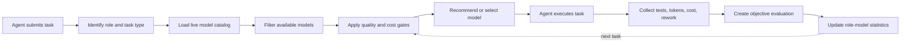
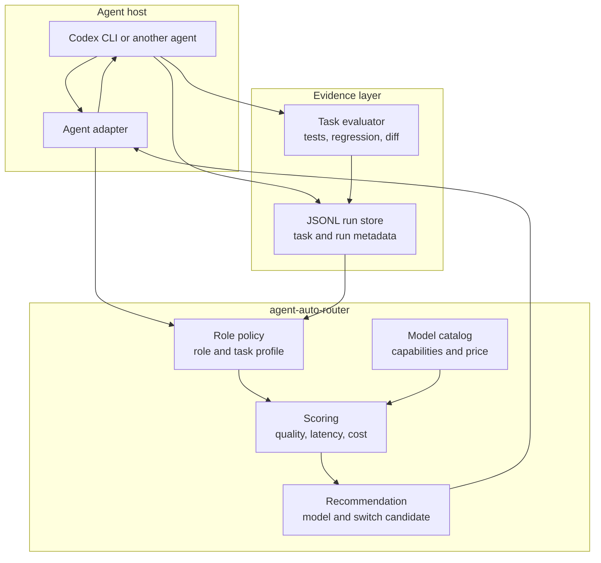

# agent-auto-router

An evidence-driven routing and evaluation tool that helps agents choose the right model for each task.

> In one sentence: the agent submits a task, `agent-auto-router` selects a model; the agent executes the task, and the router records evidence to improve the next decision.

This is not a leaderboard or a request-only proxy. Model choices are traceable, and the default behavior is observe-and-recommend until there is enough evidence to justify a switch. Codex CLI is the first validated host. Claude Code and Hermes are integrated as preview host adapters for non-interactive execution and metadata-only session ingestion.

## How to use

Run these commands from the `0genlab` repository. The tool supports two complementary workflows:

- **Execute and record:** wrap a host command or run one host stage, then store role, provider, model, status, latency, token, and cost metadata under `data/role-runs/`.
- **Import and recommend:** ingest metadata from existing Codex, Claude Code, or Hermes sessions, evaluate objective evidence, and generate provider-scoped model recommendations.

Prerequisites are Node.js 22+, the host CLI you intend to use (`codex`, `claude`, or `hermes`), and that host's existing authentication. Hermes session ingestion also requires Python 3 with its standard `sqlite3` module. The repository has no package installation step.

The host remains responsible for calling its model and using tools. `0genlab` recommends and records the provider/model identity; it does not proxy requests or replace the host CLI.

| Goal | Host | Entry point |
| --- | --- | --- |
| Execute a task and record the command | Codex CLI or any command-line agent | `scripts/codex-run.mjs` |
| Execute one non-interactive stage | Claude Code | `scripts/run-host-stage.mjs --host claude` |
| Execute one non-interactive stage | Hermes | `scripts/run-host-stage.mjs --host hermes` |
| Import historical session metadata | Codex, Claude Code, or Hermes | `scripts/ingest-*-sessions.mjs` |
| Evaluate evidence and recommend a model | Any supported host | `scripts/evaluate-run.mjs`, `scripts/role-run.mjs recommend` |

### Use with Codex or another command-line agent

`codex-run.mjs` starts a role run, executes the command after `--`, and records exit status and wall time. Use it for `codex exec` or any other command-line agent; the wrapped command does not need to know about `0genlab`. For normal interactive Codex use, keep using Codex as usual and run `ingest-codex-sessions.mjs` afterward to import session metadata.

```bash
ROLEBENCH_ROOT="$PWD" node scripts/codex-run.mjs \
  --role implementer \
  --provider aihubmix \
  --model deepseek-v4.1-flash \
  --title "Implement refund retry" \
  --type implementation \
  --project "$PWD" \
  -- \
  codex exec --full-auto "Implement refund retry and run tests"
```

The wrapper records process metadata only. It does not copy the prompt, model response, tool output, or source code.

### Use with Claude Code

`run-host-stage.mjs` builds one explicit Claude Code request. It defaults to a redacted dry-run; add `--execute` to start the host:

```bash
ROLEBENCH_ROOT="$PWD" node scripts/run-host-stage.mjs \
  --host claude \
  --role implementer \
  --provider unknown \
  --model opus \
  --prompt-file ./prompt.txt \
  --execute
```

Claude Code runs as `claude --print --output-format json --model <model>`. Use `--provider unknown` only for audit-only runs. A real provider must match the provider proven by the local Claude settings or `ANTHROPIC_BASE_URL`; the adapter never infers a provider from the model name.

For normal interactive Claude Code sessions, keep using `claude` and import the metadata afterward with `ingest-claude-sessions.mjs`.

### Use with Hermes

For Hermes, the provider and model must exist in the local supported catalog or current configuration:

```bash
ROLEBENCH_ROOT="$PWD" node scripts/run-host-stage.mjs \
  --host hermes \
  --role implementer \
  --provider "$HERMES_PROVIDER" \
  --model "$HERMES_MODEL" \
  --prompt-file ./prompt.txt \
  --execute
```

Hermes runs as `hermes chat --provider <provider> --model <model> --in <cwd> --query-file - --oneshot`. The prompt is sent on stdin and is never placed in argv.

For normal interactive Hermes sessions, keep using `hermes` and import the metadata afterward with `ingest-hermes-sessions.mjs`.

### Import existing sessions

Historical sessions can be imported without rerunning the agents:

```bash
ROLEBENCH_ROOT="$PWD" node scripts/ingest-codex-sessions.mjs
ROLEBENCH_ROOT="$PWD" node scripts/ingest-claude-sessions.mjs
ROLEBENCH_ROOT="$PWD" node scripts/ingest-hermes-sessions.mjs
```

All three importers are metadata-only. They do not persist prompts, responses, tool arguments, or source code. Use `--since` to limit an import and `--refresh` to rebuild existing session-derived runs.

### Evaluate and ask for a recommendation

Use `role-run.mjs` when the host is not wrapped by `codex-run.mjs` or `run-host-stage.mjs`:

```bash
RUN_ID="$(ROLEBENCH_ROOT="$PWD" node scripts/role-run.mjs start \
  --title "Implement refund retry" \
  --type implementation \
  --expected "Tests pass")"

# Run the selected agent and record its result.
ROLEBENCH_ROOT="$PWD" node scripts/role-run.mjs record \
  --run-id "$RUN_ID" \
  --role implementer \
  --provider aihubmix \
  --model deepseek-v4.1-flash \
  --status success \
  --tests-run 8 \
  --tests-passed 8

ROLEBENCH_ROOT="$PWD" node scripts/evaluate-run.mjs \
  --run-id "$RUN_ID" \
  --project "$PWD" \
  --test-command '["npm","test"]'

ROLEBENCH_ROOT="$PWD" node scripts/role-run.mjs recommend --provider aihubmix
```

Recommendations are provider-scoped and remain in `shadow` mode by default. They do not rewrite Codex, Claude Code, or Hermes configuration automatically.

## End-to-end loop



Selection considers role, task type, tool requirements, model availability, historical quality, success rate, latency, rework, and cost. The default policy is `shadow`: the router explains candidates and switch reasons first; gray rollout or automatic promotion requires the configured admission gates.

## Repository map

| Directory | Purpose |
| --- | --- |
| `src/core/` | Role policy, quality scoring, token/cost calculation, and shared contracts |
| `adapters/` | Codex, Claude Code, Hermes, command-line agents, provider catalogs, and JSONL adapters |
| `scripts/` | Task execution, session ingestion, price sync, evaluation, and reports |
| `configs/` | Role-model policy and switching thresholds |
| `schema/` | Run, experiment, and report formats |
| `tests/` | Core policy, adapter, and ingestion tests |

## Preview integrations

The current release focuses on role-based model evaluation and switching decisions. The host agent remains responsible for invoking the selected model and completing the task.

| Type | Integration | Status | Notes |
| --- | --- | --- | --- |
| Agent host | Codex CLI | ✅ Validated | Supports role runs, exit status, latency, tokens, cost, and passive local session ingestion |
| Agent host | Claude Code | 🧪 Preview | Metadata-only JSONL ingestion; historical provider stays `unknown` unless the session contains HTTPS route evidence or an audited override is supplied |
| Agent host | Hermes | 🧪 Preview | Read-only ingestion from `sessions` and `session_model_usage`; mixed model, provider, base URL, and billing mode usage is stored separately |
| Agent host | Generic command-line agent | 🧪 Preview | Uses `adapters/codex/command-runner.mjs`; only Codex has been validated against a real session so far |
| Model provider | AIHubMix | ✅ Validated | Reads `https://aihubmix.com/v1/models`; all current AIHubMix role defaults are present |
| Model provider | Sub2API | ✅ Validated | Reads authenticated `https://ccsub.inferera.com/v1/models`; uses a separate role pool and statistics |
| Model provider | OpenRouter | ✅ Validated | Reads `https://openrouter.ai/api/v1/models`; Responses API was verified with DeepSeek, Kimi, and GLM models |
| Direct providers | OpenAI, Anthropic, DeepSeek, and others | 🔌 Extension point | Direct connections still require their own catalog and execution adapters |
| Persistence | JSONL | ✅ Validated | Stores structured task, role, model, quality, cost, and evidence metadata |
| Evaluation | CLI tests, regression checks, and diff checks | ✅ Validated | Stores objective results without test command stdout/stderr |

### Host adapter entry points

| Host | Execution adapter | Session ingestion | Integration behavior |
| --- | --- | --- | --- |
| Claude Code | `adapters/claude/host.mjs` | `scripts/ingest-claude-sessions.mjs` | Builds a non-interactive `claude --print --output-format json` request; validates model and provider evidence before execution |
| Hermes | `adapters/hermes/host.mjs` | `scripts/ingest-hermes-sessions.mjs` | Validates the provider and model against the local Hermes catalog, then builds `hermes chat --query-file - --oneshot` |

Both adapters feed the same role-run store as Codex and remain additive: they do not change Codex ingestion, role policy, or the run schema.

### Role vocabulary

`planner`, `researcher`, `explorer`, `implementer`, `e2e`, and `reviewer` are policy roles, not providers or fixed agents. A host can map these roles to different models without copying Codex-specific configuration.

### Provider boundary

The model identity is the pair `(provider, model)`. AIHubMix, Sub2API, and OpenRouter have separate catalogs, role defaults, candidate pools, price snapshots, statistics, recommendations, and promotion decisions. A result from `aihubmix/gpt-6-sol` never contributes to `sub2api/gpt-6-sol`. Historical events using the former provider ID `ccsub` are canonicalized to `sub2api`; events without a provider are treated as `unknown` and are excluded from provider promotion decisions.

OpenRouter uses namespaced IDs such as `deepseek/deepseek-v4.1-flash`. Catalog presence does not guarantee account-level execution: models blocked by provider terms are not used as defaults even when they appear in `/models`.

### Provider configuration and activation

Provider control currently has two separate layers:

| Layer | Configuration | What it controls |
| --- | --- | --- |
| Router policy | `configs/role-policy.json` | Registered providers, provider-specific role defaults, candidate pools, statistics, recommendations, and promotion gates |
| Agent runtime | Host configuration, for example `~/.codex/config.toml` and `~/.codex/agents/*.toml` | Which provider and model actually execute a main or sub-agent session |

A provider present under `providers` in `configs/role-policy.json` participates in catalog validation and provider-specific recommendations. The current schema does not yet expose a separate `enabled`, `catalog_enabled`, or `routing_enabled` flag; removing or adding a provider is therefore a policy change rather than a runtime toggle.

For Codex, provider selection is explicit:

```toml
model_provider = "aihubmix"
model = "gpt-6-sol"

[model_providers.aihubmix]
base_url = "https://aihubmix.com/v1"
env_key = "AIHUBMIX_API_KEY"

[model_providers.sub2api]
base_url = "https://ccsub.inferera.com/v1"
env_key = "AIHUBMIX_SUB_CX_API_KEY"

[model_providers.openrouter]
base_url = "https://openrouter.ai/api/v1"
env_key = "OPENROUTER_API_KEY"
```

A role config must set both values when overriding the host default:

```toml
model_provider = "aihubmix"
model = "deepseek-v4.1-flash"
```

#### Codex runtime model catalog

Codex resolves the effective `model_provider` from `~/.codex/config.toml`, the selected profile, or a CLI override before launch. The launch wrapper refreshes only that provider's `/models` endpoint and writes the active runtime catalog to `~/.codex/model-catalogs/provider-live.catalog.json`. It never merges model lists from other configured providers, so switching providers regenerates the picker from the newly active provider on the next launch.

The runtime catalog preserves the order returned by the provider API. If the endpoint returns duplicate model IDs, the first occurrence is kept and later duplicates are ignored. If the active provider refresh fails, Codex reuses the last valid cache for that same provider; it does not substitute another provider's cache.

### Current provider defaults

These defaults are independent baselines. They do not compete across providers.

| Role | AIHubMix | Sub2API | OpenRouter |
| --- | --- | --- | --- |
| `planner` | `gpt-6-sol` | `gpt-6-sol` | `z-ai/glm-5.3` |
| `researcher` | `kimi-k3` | `gpt-6-sol` | `moonshotai/kimi-k3` |
| `explorer` | `deepseek-v4.1-flash` | `gpt-6-sol` | `deepseek/deepseek-v4.1-flash` |
| `implementer` | `deepseek-v4.1-flash` | `gpt-6-sol` | `deepseek/deepseek-v4.1-flash` |
| `e2e` | `claude-opus-5-5` | `gpt-6-sol` | `z-ai/glm-5.3` |
| `reviewer` | `gpt-6-sol` | `gpt-6-sol` | `z-ai/glm-5.3` |

The defaults and all candidates were checked against the live catalogs on September 23, 2026. OpenRouter defaults use models that also passed account-level Responses API probes; catalog-only OpenAI and Anthropic entries that returned provider Terms of Service errors were not selected as defaults.

## How it works

`configs/role-policy.json`, `src/core/role-policy.mjs`, and `scripts/role-run.mjs` provide the model-selection layer used by an agent:

- **Role and task profile:** identify the work stage, tools, language, risk, and expected outcome.
- **Candidate selection:** load available models and remove candidates that fail capability or availability checks.
- **Quality gates:** compare success rate, objective quality, regression results, latency, rework, and cost.
- **Evidence recording:** persist the selected model, execution result, tests, tokens, cost, and evidence references.
- **Policy updates:** aggregate results by role and distinct task; recommend a switch only when the configured sample and quality gates are met.
- **Safety default:** remain in `shadow` mode and never rewrite host configuration without an explicit promotion step.

Passive sessions tagged only as `role = main` are useful for provider usage and cost reporting, but they do not count as `planner`, `implementer`, or other role-specific evidence. Automatic promotion requires provider-tagged, role-tagged, objectively evaluated samples for both the candidate and its provider-local baseline.

### Operating principle



The router answers **which model, why it was selected, whether a switch is allowed, and how the result performed**. The host agent answers **how to call the model, use tools, and complete the task**. The policy core therefore stays independent of Codex and any single provider.

## Detailed workflows

### Record a role run

```bash
RUN_ID="$(node scripts/role-run.mjs start --title "Implement refund retry" --type implementation --expected "Tests pass")"
node scripts/role-run.mjs record --run-id "$RUN_ID" --role implementer \
  --provider aihubmix \
  --model deepseek-v4.1-flash --status success --quality-score 4.2 \
  --tests-run 8 --tests-passed 8 --rework-count 0
node scripts/role-run.mjs recommend --provider aihubmix
```

### Record a Codex command

Use the adapter explicitly when you want to record a Codex-compatible command:

```bash
ROLEBENCH_ROOT=/path/to/agent-auto-router node scripts/codex-run.mjs \
  --role implementer --model deepseek-v4.1-flash \
  --provider aihubmix \
  --title "Implement refund retry" --type implementation \
  --task-family implementation --repo-language go \
  --tool-profile terminal+tests -- \
  codex exec --full-auto "Implement refund retry and run tests"
```

The command records an `agent_finished` event and latency. Add test results, quality, cost, and evidence in the evaluation step; a failed exit code remains a failure and is never converted into a quality score.

### Evaluate objective evidence

```bash
ROLEBENCH_ROOT=/path/to/agent-auto-router node scripts/evaluate-run.mjs \
  --run-id "$RUN_ID" --project /path/to/project \
  --test-command '["npm","test"]' \
  --regression-command '["python3","regression_test.py"]'
```

The evaluator writes structured results without storing test command stdout/stderr.

### Sync and validate provider catalogs

```bash
ROLEBENCH_ROOT=/path/to/agent-auto-router node scripts/sync-provider-catalogs.mjs
ROLEBENCH_ROOT=/path/to/agent-auto-router node scripts/validate-provider-models.mjs
```

This repository command refreshes all provider snapshots for router policy validation. It is separate from the provider-scoped runtime catalog generated by the Codex launch wrapper. The validator fails when a provider-specific default or candidate is missing from that provider's live catalog.

Current catalog endpoints and credentials:

| Provider | Catalog | Authentication |
| --- | --- | --- |
| AIHubMix | `https://aihubmix.com/v1/models` | Public catalog; execution uses `AIHUBMIX_API_KEY` |
| Sub2API | `https://ccsub.inferera.com/v1/models` | Bearer token from `AIHUBMIX_SUB_CX_API_KEY` |
| OpenRouter | `https://openrouter.ai/api/v1/models` | Public catalog; execution uses `OPENROUTER_API_KEY` |

### Sync model prices

```bash
ROLEBENCH_ROOT=/path/to/agent-auto-router node scripts/sync-model-prices.mjs --provider aihubmix
ROLEBENCH_ROOT=/path/to/agent-auto-router node scripts/sync-model-prices.mjs --provider openrouter
```

Snapshots are written to `data/model-price-snapshots/<provider>.json`. AIHubMix and OpenRouter prices are never shared, even when model names look similar. Sub2API cost remains `null` until a trusted Sub2API price source is configured.

### Run a multi-model experiment

```bash
ROLEBENCH_ROOT=/path/to/agent-auto-router node scripts/run-role-experiment.mjs \
  --task schema/role-experiment.example.json \
  --role implementer \
  --provider aihubmix \
  --models deepseek-v4.1-flash,deepseek-v4-pro
```

Each model gets an independent run and evaluation report. The command does not rewrite role configuration. Summarize a report with:

```bash
node scripts/summarize-experiment.mjs \
  --report data/experiments/role-implementer-implementation-001.json
```

The summary reports `insufficient_evidence` instead of recommending a cheap model without enough evidence. Aggregated recommendations use distinct task IDs rather than counting repeated runs of one task as independent evidence.

### Ingest real Codex sessions

Existing local Codex sessions can be ingested without creating synthetic experiments:

```bash
ROLEBENCH_ROOT=/path/to/agent-auto-router node scripts/ingest-codex-sessions.mjs
```

The ingester records session metadata, role, model, latency, tokens, and cost. It does not copy prompts, responses, tool output, or source code, and repeated ingestion is deduplicated by session ID.

### Ingest Claude Code sessions

Claude Code stores local sessions as JSONL under `~/.claude/projects` by default:

```bash
ROLEBENCH_ROOT=/path/to/0genlab node scripts/ingest-claude-sessions.mjs
```

The ingester extracts only metadata, elapsed time, model, and usage. It never stores prompt text, response text, tool arguments, or source code. JSONL is read incrementally in chunks, so long sessions do not need to fit in one string; malformed records and a final truncated line are skipped and reported as `malformed_line_count`. Timestamps are reduced to `started_at`, `ended_at`, and `latency_ms` instead of being retained as an unbounded list. Repeated assistant records are deduplicated by `message.id`, retaining the latest usage record. Usage is retained as an aggregate for compatibility and also split into `model_groups`; ingestion creates one run, price lookup, and `agent_finished` event per model. Re-importing a session that gained messages refreshes its existing same-model run automatically; `--refresh` forces a rebuild even when no source changes are detected.

Historical ingestion does not apply the current Claude settings retroactively. The provider remains `unknown` unless the session itself contains verifiable HTTPS route evidence or the caller supplies an explicit `--audited-provider` override. If the override conflicts with session route evidence, the evidence wins and the result remains verified for the evidence-backed provider. The host execution path still validates the current settings or `ANTHROPIC_BASE_URL`. A provider is never inferred from a model name.

Use `--sessions-dir`, `--claude-home`, `--since`, `--refresh`, or an explicit `--audited-provider` override to narrow or rebuild an import.

### Ingest Hermes sessions

Hermes stores state in SQLite, normally at `~/.hermes/state.db`:

```bash
ROLEBENCH_ROOT=/path/to/0genlab node scripts/ingest-hermes-sessions.mjs
```

The adapter opens the database read-only through Python's standard-library `sqlite3` and selects only `sessions` plus `session_model_usage`. It does not read the `messages` table or persist prompts, responses, system prompts, or titles. Usage is grouped by `(session, model, provider, billing_base_url, billing_mode)`, so a session that switches models, providers, routes, or billing modes produces separate records while repeated ingestion remains idempotent. Known HTTPS billing hosts are used as provider evidence; a conflicting provider label is not retained as a verified mismatch. Actual cost is trusted only when `cost_status` or `cost_source` says `actual`, including a legitimate zero; estimated values remain separate and unknown schema defaults are not treated as actual. Older schemas with missing columns or without `session_model_usage` are accepted.

Use `--db`, `--hermes-home`, `--since`, or `--refresh` to select or rebuild an import.

### Run one host stage

`run-host-stage.mjs` builds one explicit, non-interactive Claude Code or Hermes request. It defaults to a redacted dry-run and does not start the host unless `--execute` is present:

```bash
node scripts/run-host-stage.mjs \
  --host claude \
  --role implementer \
  --provider unknown \
  --model opus \
  --prompt-file ./prompt.txt
```

Use the same entry point for Hermes after substituting values from its local supported catalog:

```bash
node scripts/run-host-stage.mjs \
  --host hermes \
  --role implementer \
  --provider "$HERMES_PROVIDER" \
  --model "$HERMES_MODEL" \
  --prompt-file ./prompt.txt
```

The prompt is read from `--prompt-file` or stdin, never from a `--prompt` command-line value. For Claude Code, `--provider unknown` is accepted as audit-only. A non-unknown provider is rejected unless the local settings or the wrapper process's `ANTHROPIC_BASE_URL` proves that route. For Hermes, the provider and model must match the local supported catalog or current configuration exactly, and the command runs as `hermes chat --provider <provider> --model <model> --in <cwd> --query-file - --oneshot` with the prompt on stdin. The wrapper records role, provider, model, exit status, and latency, but does not persist command output.

Hermes' safe stdin invocation does not support the legacy top-level `--usage-file` option, so host-stage execution does not pass a prompt through argv and records token usage as `null` for this path. If a usage file is supplied by another caller and exists, malformed JSON, non-object JSON, non-finite token fields, or a payload with no usable token count produces a terminal `status = failed` event with `failure_mode = usage_invalid`; a missing usage file remains allowed. Caller-owned usage files are read but preserved; only temporary usage files created during host preparation are removed after use.

## Design boundaries

- Secrets must come from environment variables and be redacted before persistence.
- Objective evidence is preferred over an LLM judge in the default scoring path.
- Missing usage, price, or evaluation evidence stays `null`; the system does not guess.
- Claude and Hermes adapters are additive and do not change Codex ingestion, role policy, or the run schema.
- Jev is not part of the default Codex role chain or promotion path.
- The core does not rewrite host configuration while operating in `shadow` mode.
- Derived metrics should be regenerated by scripts rather than edited manually.
